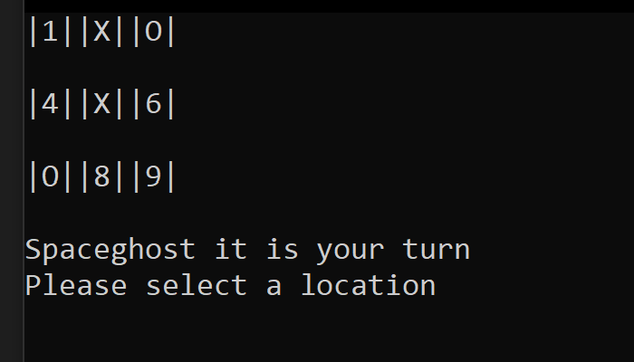

# Lab04: Tic Tac Toe
*Authors: Scott Falbo, Krystian Francuz-Harris, Ameilia Valdes, and Michael Falk*  Version: 1.0.0 

## Overview
A two player terminal Tic Tac Toe game.  

## Getting Started
+ From the command line: `git clone https://github.com/scottfalbo/lab04-tic-tac-toe`
+ Open in Visual Studio and run the app from `program.cs`
### Game Controls
+ Both players will be prompted to enter their name.
+ A board with numbered squares will be presented.
+ Players will take turns entering squares until:
  + A player either wins, or
  + There are no more moves.

## Example
### Sample Game Screen

## Architecture
+ The `Main` method call the `StartGame` method:
  + `StartGame` instantiates two players using the `Player` class.
  + Then passes those two objects to `MakeGame` to instantiate a new `Game` object.
  + `newGame.Play(playerOne, playerTwo)` calls the `Play` method within class `Game` and passes it the player objects.
  + The `Game.Play()` method controls the game and returns either the winner or a draw in the form of a `Player` object.

## Change Log
+ 1.0.0 - *01/14/2021* - Built out and wired up the first three sections of the architecture section in lab with Krystian Francuz-Harris, Ameilia Valdes, and Michael Falk.
+ 1.0.1 - *01/14/2021, 9:00pm* - Getting back on it alone.  
  + Implemented a `while` loop in the `Play()` method to track turns taken.
  + Determine who's turn it is with the `NextPlayer()` method.
  + Use that return to call `TakeTurn()`
  + Using `DisplayBoard()` in between each move.
  + Added a `marker` param to the `Player` constructor and used a ternary to assign it "X" or "O".
+ 1.0.2 - *01/14/2021, 9:35pm* - Got the game running as intended.
  + Created a `bool winner` to track a win via `CheckForWinner()`.
  + If `winner` is true then `Play()` returns the winning players object.  
    + else if no one won `Play()` returns a new `Player` object with `Name = "draw"`.
  + The `StartGame` function is returned the results and `Writes` an according message.

## Attribution
  + Krystian Francuz-Harris, Ameilia Valdes, and Michael Falk
